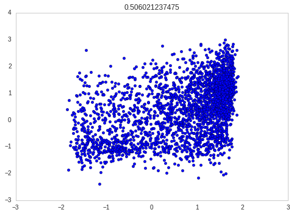
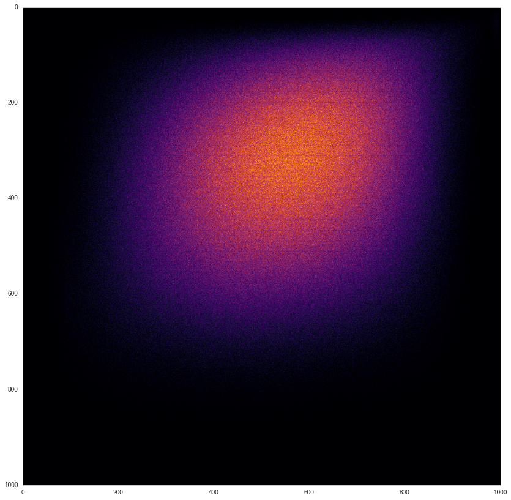
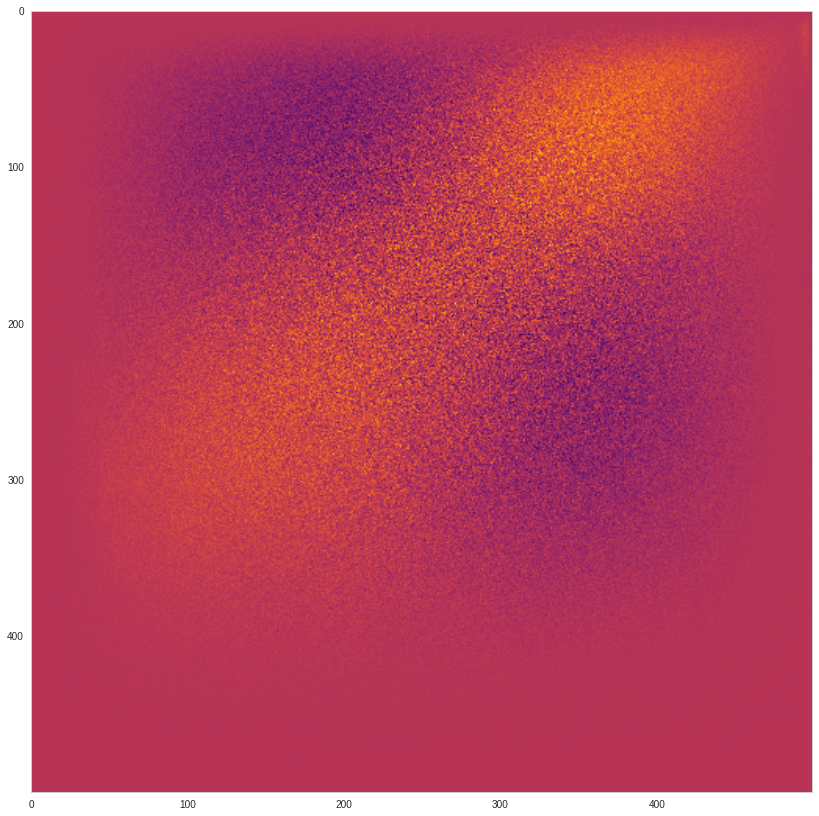

### We will be building up on this concept, from the NACC analysis paper

We take a list of homologous pairs of genes between amphi and zebra.    
    
    homology_list = [ [gene1, gene1'], [gene2,gene2'],[gene2,gene2''], .. etc..]    
    
For each pair (pair1 = [gene1,gene1']), we calculate how each gene
correlates with all its species' other genes from the list.
We now have two lists of numbers, the correlations on the 
"zebrafish side of the homology list" and the "amphioxus side".    

If we scatterplot these values against each other, it looks something like this:    

When we scatterplot all the pairs together, it makes more sense to plot a heatmap instead:    

We can correct the signal a bit, by subtracting a "control" heatmap (based on randomizing the gene connections)    

