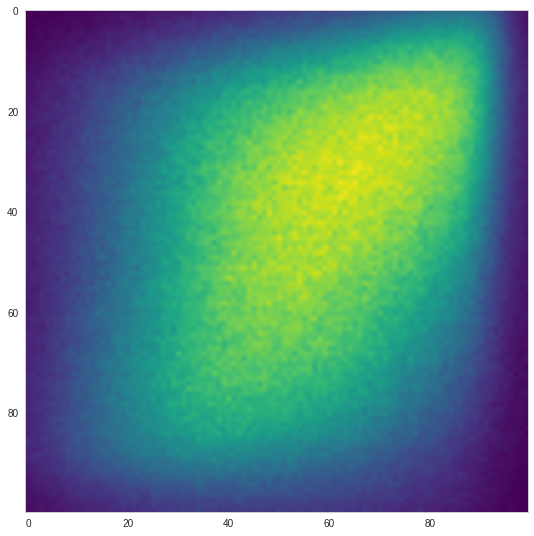
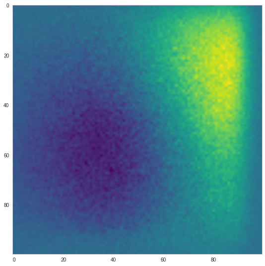
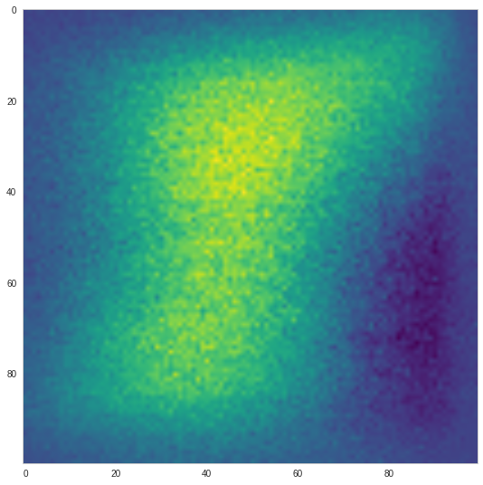

### We will be building up on this concept, from the NACC analysis paper

We take a list of homologous pairs of genes between amphi and zebra.    
    
    homology_list = [ [gene1, gene1'], [gene2,gene2'],[gene2,gene2''], .. etc..]    
    
For each pair (pair1 = [gene1,gene1']), we calculate how each gene
correlates with all its species' other genes from the list.
We now have two lists of numbers, the correlations on the 
"zebrafish side of the homology list" and the "amphioxus side".    

If we scatterplot these values against each other, it looks something like this:    

When we scatterplot all the pairs together, it makes more sense to plot a heatmap instead:    
    
    
    
We can correct the signal a bit, by subtracting a "control" heatmap (based on randomizing the gene connections)    

    
        
Based on this, we say that we see a clear correlation between the homologous genes  
between the species. When gene1 correlates well with geneN in amphi, gene1' in  
zebra will tend to correlate well with gene1'.    
    
    
### We will do something very similar
We will make the homology list stricter, by only including the 1-1 gene pairs.    
    
We can now scatter plot two genes (g1, g1'), where xi will be the correlation of g1' and gi'  
and where yi will be correlation of g1 and gi.    
    
We can also calculate a correlation between g1 and g1', based on their correlations with
the stricter homology list, or else, how well the markers on the scatterplot correlate.    
    
This is nice example of two gene with a correlation >0.5:    
    

This is how all possible gene pairs look like, when compared through the stricter homology list:    
    
And this the same "controlled":    
    

These are all the 1-1 gene connections, controlled:
    
And finally all the 1-x gene connections, controlled:
    

