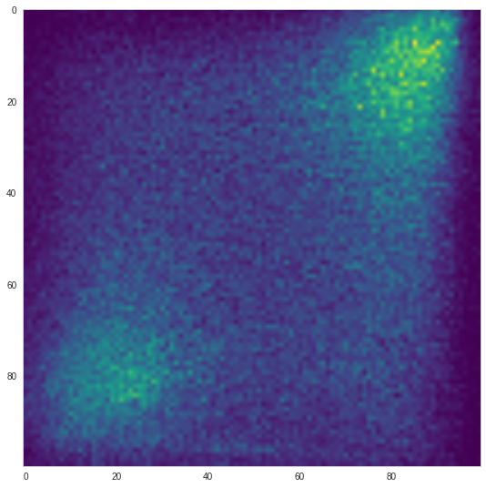
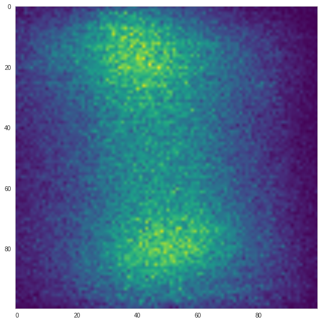
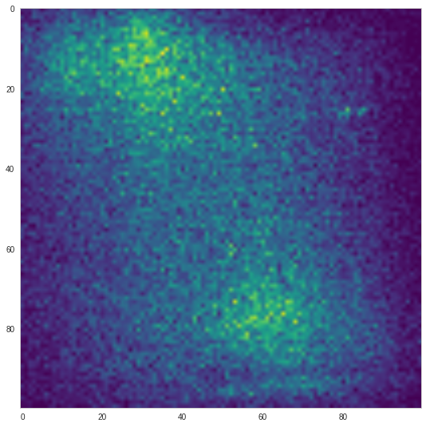
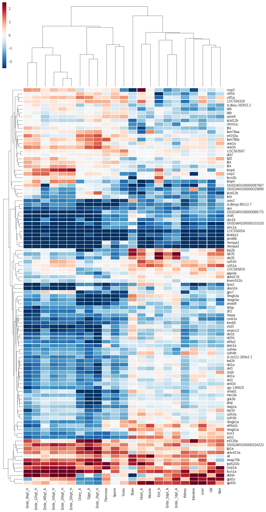

### We will be building up on this concept, from the NACC analysis paper

We take a list of homologous pairs of genes between amphi and zebra.    
    
    homology_list = [ [gene1, gene1'], [gene2,gene2'],[gene2,gene2''], .. etc..]    
    
For each pair (pair1 = [gene1,gene1']), we calculate how each gene
correlates with all its species' other genes from the list.
We now have two lists of numbers, the correlations on the 
"zebrafish side of the homology list" and the "amphioxus side".    

If we scatterplot these values against each other, it looks something like this:    

When we scatterplot all the pairs together, it makes more sense to plot a heatmap instead:    
    
    
    
We can correct the signal a bit, by subtracting a "control" heatmap (based on randomizing the gene connections)    

    
        
Based on this, we say that we see a clear correlation between the homologous genes  
between the species. When gene1 correlates well with geneN in amphi, gene1' in  
zebra will tend to correlate well with gene1'.    
    
    
### We will do something very similar
We will make the homology list stricter, by only including the 1-1 gene pairs.    
    
We can now scatter plot two genes (g1, g1'), where xi will be the correlation of g1' and gi'  
and where yi will be correlation of g1 and gi.    
    
We can also calculate a correlation between g1 and g1', based on their correlations with
the stricter homology list, or else, how well the markers on the scatterplot correlate.    
    
This is nice example of two gene with a correlation >0.5:    
    

This is how all possible gene pairs look like, when compared through the stricter homology list (controlled):       
    
    
These are all the 1-1 gene connections, controlled:    
    
And finally all the 1-x gene connections, controlled:    
      
    
        
### Then  
Remember we can now calculate the correlation of g1 to g1' ,
by calculating the correlation of their correlations with the strict homology_list.    

We will look for interesting gene families. We want gene families where    
at least one of the ohnologues is well correlated with the amphioxus 'ancestor',    
and at least one is either anti-correlated or is at least X amount less    
correlated than the well-correlated ohnologue.    
    
We apply this logic and come up with 71 families and 141 pairs of honologues    
where we detected a differential correlation to the 'ancestor gene'.     
      
We take all the well correlated genes, from the chosen pairs and plot them against their amphioxus homologue:   
      

Then the anticorrelated ohnologues, against their amphioxus homologue:   
      
    
If we are a bit stricter with our selection (32 families, 44 genes) the anticorrelated genes look even nicer:   
      

### There's more !    
    
We made a list of pairs of ohnologues, with each pair having a correlated and an anticorrelated ohnologue.    
For each anticorrelated ohnologue in each pair, and for each RNA sample we have, we will now calculate  
how much the anticorrelated honologue *gained* or *lost* in expression, by substracting from its  
expression value, the value of its well-correlated ohnologue.    
    
Now we have a list of anti-correlated ohnologues, and how much they gained or lost in expression  
in each RNA sample.    
    
And we can cluster them !    
      

